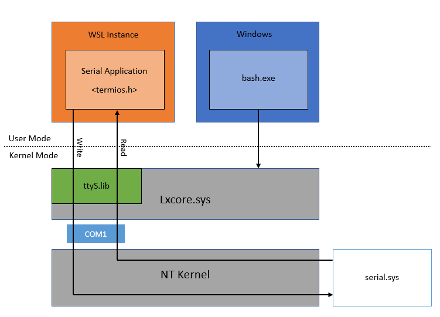
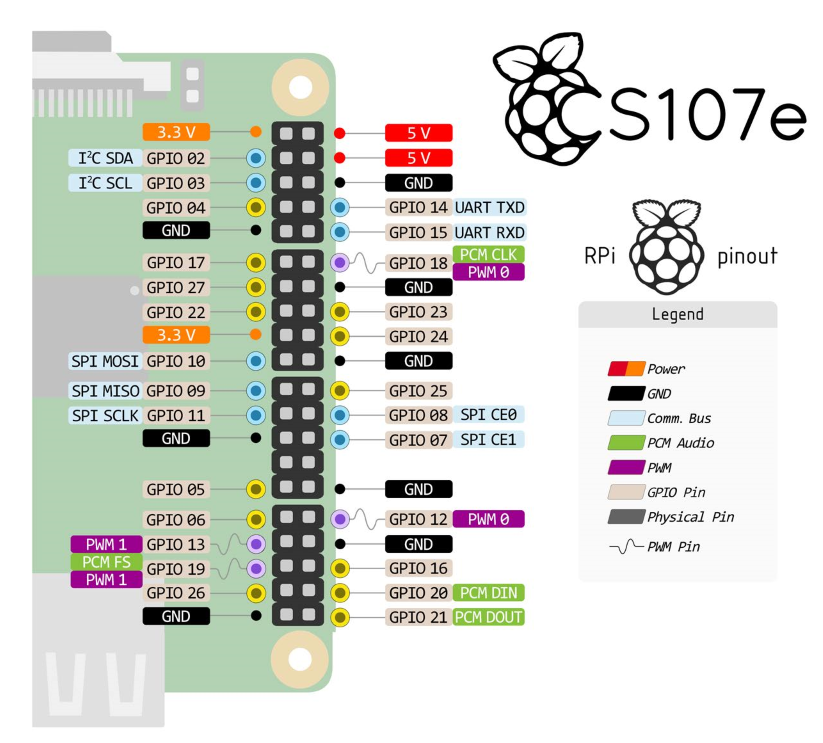

I'm trying to finish Stanford CS140e, an online experimental cirriculum on operating system, which aims to make a really runnable operating system on Raspberry Pi A+. This article presents the key to finish lab 0—use Pi's GPIO to light up the LED.

> In the original lab environment setting, the students are all Linux or Max OS users. We choose to use Windows with WSL to finish this lab.

# Goals
* Run a bare metal program on Raspberry Pi
* Use Windows Subsystem for Linux (WSL) to control Raspberry Pi to turn on the LED

The goals are designed to test whether our devices work properly and teach us to understand how to use USB-Serials Bridge to run program on Pi on WSL.

# Environment and Preparation
* Raspberry Pi A+
* 3V LED*1
* Ubuntu 16.04 WSL
* Female to female dupont wire*6
* Silicon Labs CP2102 USB-TTL adapter
* Firmware files provied by [CS107e](https://github.com/cs107e/cs107e.github.io/tree/master/firmware)
* `pi-install.py` provided by [CS107e](https://github.com/cs107e/cs107e.github.io/tree/master/cs107e/bin)  github repository

> It is worth noting that other version of Raspberry Pi would not properly boot due to their different SoC platforms. Maybe Pis with the same SoCs (BCM2635) are possible to boot successfully by the firmware provided by the course. But i haven't tried it.

## Difference of USB Serial between WSL and Linux
Here is the design of WSL architecture relative to USB serials:

There is a interface in the Lxcore.sys serving as a **bridge** between WSL instance and NT kernel. Any USB-Serial communication would be converted to a abtract `ttyS` request and then be treated as a USB-Serial request. Therefore, any USB-Serial communication handled by WSL instance are all packaged user mode data. 

## The Start Up Process of Pi
To boot a Raspberry Pi, it need three firmware files, `start.elf`, `bootcode.bin` and `kernel.img`. These files must be stored on an FAT32 format volume on an SD Card. When a Pi is powered on, its GPU firstly loads `bootcode.bin` from the file system and then execute `bootcode.bin`. After that, `start.elf` is loaded to initiate some necessary actions. Finally, the kernel image `kernel.img` is loaded.

During the process, `start.elf` and `bootcode.bin` play the similar role as BIOS on PC. They are all executed by GPU to make some preparetion for the loading of the kernel.

# Lab 0 —Blink LED via GPIO
We power up the Pi by USB-TTY adapter rather than the power interface on the Pi.

The following is the GPIO pins:

## Blink LED since the Pi starts
In the former section, we have introduced the brief process of the start-up of Pi. We can blink the LED via following steps:

1. Connect `TX/RX` of the CP2102 to GPIO's `RX/TX`
2. Connect `5V` and `GND` of GPIO to CP2012
3. Move the firmware files of CS107e to SD card.
4. Substitute the `image.img` in the SD card with `part1/blink-20.bin` 
5. rename `part1/blink-20.bin` to `image.img`
6. Plug the CP2102 to USB interface

Then, we power on the Raspberry Pi and then we can see the LED is blinking.

## Use USB Serial to make LED Blink

Different from the previous, we can also use use CP2102 to transfer the blink program to the Pi and run it.

The detailed steps is shown as follows:
1. Connect `TX/RX` of the CP2102 to GPIO's `RX/TX`
2. Connect `5V` and `GND` of GPIO to CP2012
3. Move the firmware files of CS107e to SD card.
4. Substitute the `image.img` in the SD card with `boodloader.bin` 
5. rename `boodloader.bin` to `image.img`
6. Plug the CP2102 to USB interface
7. Execute the commnad `pi-install.py part1/blink-20.bin`

You can see that after you have finished step 7, the LED is blinking.

# Reference
1. [Understanding the Raspberry Pi Boot Process](https://wiki.beyondlogic.org/index.php?title=Understanding_RaspberryPi_Boot_Process)
2. [Serial Support on the Windows Subsystem for Linux](https://docs.microsoft.com/zh-cn/archive/blogs/wsl/serial-support-on-the-windows-subsystem-for-linux)
3. [How to display pictures in Hexo](https://blog.csdn.net/lwcxy966/article/details/91363965)
